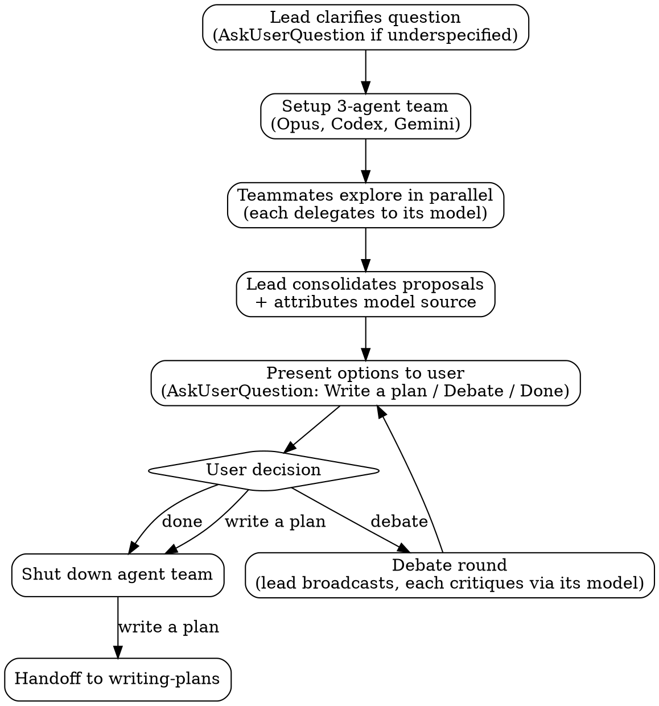

# MAGI EX

Multi-model deliberation system. Spawns Scientist, Mother, and Woman teammates backed by Claude Opus, OpenAI Codex, and Google Gemini to explore a question in parallel, then consolidates their proposals for the user.

## Checklist

Follow these steps in order.

1. Clarify the question
2. Set up agent team
3. Parallel exploration
4. Consolidate and present options
5. Wait for user decision (write a plan, debate, or done)
6. Tear down agent team

## Workflow

## The Process

### User Question

<user_question>
**$ARGUMENTS**
</user_question>

### Clarify

Before spawning teammates, the lead asks via `AskUserQuestion` to understand the idea or topic:

- Ask questions one at a time to refine the idea
- Prefer multiple choice questions when possible, but open-ended is fine too
- Only one question per message
- Focus on understanding: purpose, constraints, success criteria

Skip if the question is already clear and actionable. Include all clarified context in teammate spawn prompts.

### Setup

- Read all 3 template files: [MAGI-1.md](templates/MAGI-1.md), [MAGI-2.md](templates/MAGI-2.md), [MAGI-3.md](templates/MAGI-3.md)
- Read both reference files: [codex.md](references/codex.md), [gemini.md](references/gemini.md)
- `TeamCreate` with a descriptive team name `magi-{topic}` (e.g., `magi-auth-strategy`)
- Spawn all 3 teammates in a **single message** (3 parallel `Task` calls):

| Teammate  | `name`      | `subagent_type`   | Prompt includes                                                              |
| --------- | ----------- | ----------------- | ---------------------------------------------------------------------------- |
| Scientist | `scientist` | `general-purpose` | MAGI-1.md template + user question + clarified context                       |
| Mother    | `mother`    | `general-purpose` | MAGI-2.md template + codex.md reference + user question + clarified context  |
| Woman     | `woman`     | `general-purpose` | MAGI-3.md template + gemini.md reference + user question + clarified context |

- Set `team_name` on each `Task` call to the team name from above
- Teammates don't inherit the lead's conversation history -- include all context in the spawn prompt

### Explore in Parallel

Teammates begin working immediately upon spawning. The lead's role is **coordination only**:

- Wait for teammates to send their proposals via `SendMessage`
- Forward teammate clarifying questions to the user via `AskUserQuestion` -- note which teammate (and which model) asked
- Your role is to wait and coordinate -- teammates produce all proposals

Each teammate follows their own model-specific checklist defined in their template.

### Consolidate + Present

Lead collects all proposals from the 3 teammates, then:

1. Deduplicates similar proposals (attributing to all teammates/models that proposed it)
2. Groups by theme if there are many proposals
3. Presents each option with:
   - Which teammate(s) and model(s) proposed it (e.g., "Scientist [Opus]", "Mother [Codex]")
   - Trade-off analysis from each perspective
   - Who tagged it as their top pick and why
4. Asks the user via `AskUserQuestion` to **select an option** (one option per choice)
5. Asks the user via `AskUserQuestion` what to do next:
   - **Write a plan** -- triggers teardown + handoff to `writing-plans` with the selected option
   - **Debate** -- teammates critique each other's proposals (triggers debate round below)
   - **Done** -- shut down the agent team, no further action

### Optional Debate (user-triggered)

Only runs if the user requests it. When triggered:

1. Lead broadcasts the consolidated option list to all 3 teammates via `SendMessage`
2. Each teammate sends the proposals to their model for critique:
   - Scientist (Opus): reasons directly about other proposals
   - Mother (Codex): calls `mcp__codex__codex-reply` with saved `threadId`
   - Woman (Gemini): pipes full context + proposals to `gemini -p -`
3. Each teammate sends their model's critique back to the lead via `SendMessage`
4. Lead collects updated stances and re-presents to the user

One round per debate request. The user can trigger multiple sequential debates.

### Teardown

#### When to tear down

- User selects **Write a plan**
- User selects **Done**

#### Keep teammates alive during the debate loop

Tear down only after the user selects **Write a plan** or **Done**.

#### Shutdown sequence

1. `shutdown_request` to each teammate (Scientist, Mother, Woman)
2. Wait for all shutdown approvals
3. `TeamDelete` (fails if teammates are still active)

### Handoff (write a plan path only)

After teardown, invoke `writing-plans` skill with the chosen option(s) as context.
