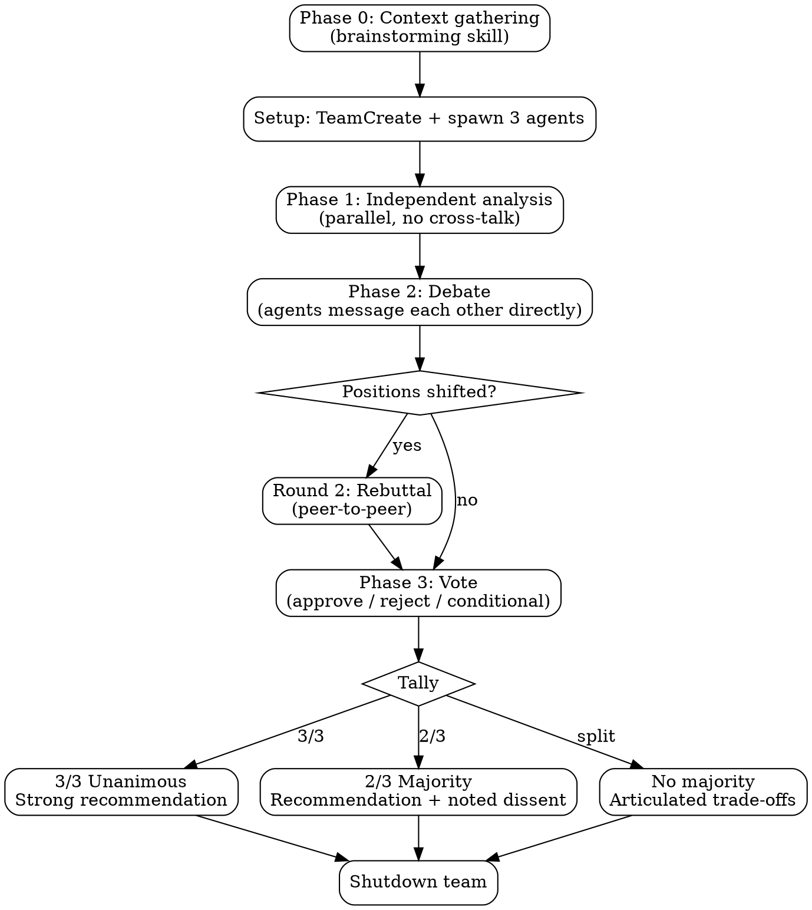

# MAGI

Three-agent deliberation system inspired by the MAGI from Neon Genesis Evangelion. Three persistent agents with distinct cognitive modes analyze independently, debate each other directly (peer-to-peer), and vote to reach consensus (2/3 majority or 3/3 unanimous) before any recommendation is issued.

## Perspectives

| Unit          | Mode                                          | Core Question                                |
| ------------- | --------------------------------------------- | -------------------------------------------- |
| **Scientist** | Analytical -- evidence, logic, data           | What does the evidence say?                  |
| **Mother**    | Protective -- risk, stability, sustainability | What could go wrong? Do we even need to act? |
| **Woman**     | Creative -- intuition, elegance, pragmatism   | What's the elegant path?                     |

Perspectives adapt per domain. Before spawning, map each mode to the specific task:

| Domain        | Scientist                | Mother                       | Woman                    |
| ------------- | ------------------------ | ---------------------------- | ------------------------ |
| Architecture  | Correctness, performance | Reliability, maintainability | Developer experience     |
| Debugging     | Systematic root cause    | Impact, regression risk      | Pattern recognition      |
| Decisions     | Quantitative analysis    | Downside protection          | Upside capture           |
| Brainstorming | Feasibility, constraints | Sustainability, safety       | Innovation, user delight |

## Workflow



### Phase 0: Context Gathering

**REQUIRED SUB-SKILL:** Use `superpowers:brainstorming` approach before spawning the team.

1. Start from the user's question: **$ARGUMENTS**
2. Explore the current project state (files, docs, recent commits)
3. Ask the user clarifying questions -- one at a time, multiple choice preferred
4. Focus on: purpose, constraints, success criteria, prior art, non-goals
5. Package all Q&A into the `{RELEVANT_BACKGROUND}` section of each agent's spawn prompt

This phase ensures all three agents receive rich, validated context instead of guessing.

### Setup

1. `TeamCreate` with team name `"magi"`
2. Map the three perspectives to the domain at hand
3. `TaskCreate` three analysis tasks (one per agent)
4. Spawn 3 teammates via `Task` tool (see Agent Prompt Template below):
   - `subagent_type: "general-purpose"`, `team_name: "magi"`, `model: "opus"`
   - `name: "scientist"` / `"mother"` / `"woman"`
5. `TaskUpdate` to assign each task by `owner`
6. Switch to **delegate mode** (Shift+Tab) so the lead only orchestrates, never implements

### Phase 1: Independent Analysis

Each agent works from their perspective only. **No cross-communication.** Each produces:

- **Thesis**: Core position (2-3 sentences)
- **Evidence**: Specific supporting arguments
- **Risks**: What could go wrong with this approach
- **Recommendation**: Concrete actionable suggestion

Wait for all 3 to complete (idle notifications + TaskList showing all completed).

### Phase 2: Debate

The lead forwards all three Phase 1 analyses to each agent, then **steps back**. Agents debate directly with each other via `SendMessage` -- the lead does NOT mediate.

**Round 1 -- Challenge:** Each agent messages the other two directly:

1. Where their analysis aligns with yours
2. Challenge at least one specific claim with a counter-argument
3. Blind spots their perspective missed
4. Whether you would revise your position given their evidence, and why

The lead monitors via idle notifications (which include peer DM summaries) but does not intervene.

**Round 2 -- Rebuttal (if positions shifted):** If any agent revised their position in Round 1, the lead sends a follow-up to all three asking them to respond to the revisions. Agents again message each other directly. If all three held firm in Round 1, skip to Phase 3.

Cap at 2 debate rounds. More adds noise, not insight.

### Phase 3: Vote

After debate concludes, the lead `SendMessage`s each agent requesting a formal vote:

> Based on the full debate, cast your vote:
> - **APPROVE**: You endorse this direction
> - **REJECT**: You oppose -- state what would change your vote
> - **CONDITIONAL**: You approve IF [specific condition]
>
> State your vote, a one-sentence rationale, and any unresolved concerns.

Wait for all 3 votes. Tally:

| Result | Meaning |
|--------|---------|
| **3/3 Unanimous** | Strong recommendation -- all perspectives aligned |
| **2/3 Majority** | Recommendation with noted dissent -- present the minority concern |
| **No majority** | No recommendation -- present the trade-offs, user decides |

### Synthesis

Team lead reads the votes and full debate record, then presents to the user:

**Unanimous (3/3):** Unified recommendation with high confidence. Note which strengths each perspective contributed.

**Majority (2/3):** Recommendation from the majority, with the dissenting perspective's core concern highlighted. State what conditions would flip the dissent.

**No majority:** Each position summarized, the core dilemma articulated, trade-offs mapped. The MAGI system provides the analysis, not a forced consensus -- the user decides.

### Cleanup

`SendMessage` with `type: "shutdown_request"` to each agent. Wait for all shutdown responses before calling `TeamDelete`.

## Agent Prompt Template

```
You are **The {NAME}** of the MAGI system -- a three-agent deliberation council.

Your cognitive mode: **{MODE_DESCRIPTION}**
For this task, your focus: {DOMAIN_SPECIFIC_FOCUS}
Your core question: "{CORE_QUESTION}"

## Task
{TASK_DESCRIPTION}

## Output Format
**Thesis:** [core position, 2-3 sentences]
**Evidence:** [specific supporting arguments]
**Risks:** [what could go wrong with your approach]
**Recommendation:** [concrete actionable suggestion]

## Context
{RELEVANT_BACKGROUND — teammates do NOT inherit conversation history, include everything needed here}

## Rules
- Argue your perspective FULLY -- do not hedge or try to be balanced
- Be specific and concrete, not abstract
- Support claims with evidence or reasoned argument
- You will get a chance to debate others directly in Phase 2
- Check TaskList for your assigned task; mark in_progress then completed
- Send your analysis to the team lead via SendMessage when done

## Debate (Phase 2)
- Message other agents DIRECTLY via SendMessage (names: scientist, mother, woman)
- Challenge specific claims -- not vague disagreements
- You MAY revise your position if persuaded -- state what changed and why
- Do NOT soften your position to be polite -- genuine disagreement produces better outcomes

## Voting (Phase 3)
When the lead calls for a vote, respond with:
- **Vote:** APPROVE / REJECT / CONDITIONAL
- **Rationale:** One sentence
- **Unresolved concern:** (if any)
```

## Common Mistakes

| Mistake                          | Fix                                                                                            |
| -------------------------------- | ---------------------------------------------------------------------------------------------- |
| Agents converge immediately      | Prompt says "argue fully, do not hedge"                                                        |
| Lead mediates debate             | Forward Phase 1 outputs, then step back -- agents message each other directly                  |
| Agents don't message each other  | Spawn prompt must list peer names and explicitly instruct direct SendMessage                    |
| Agents water down positions      | Prompt says "do NOT soften to be polite"                                                       |
| Skipping the vote                | Always require formal vote -- it forces agents to commit to a position                         |
| Perspectives too similar         | Verify domain mapping creates genuine tension before spawning                                  |
| Skipping synthesis               | Always produce structured consensus or disagreement output with vote tally                     |
| Too many debate rounds           | Cap at 2 rounds -- more adds noise, not insight                                                |
| Agent goes silent                | Send follow-up message; if still no response, proceed with available analyses and note the gap |
| Lead starts implementing         | Use delegate mode (Shift+Tab) to restrict lead to coordination only                            |
| Teammates lack context           | Include ALL relevant context in spawn prompt -- they don't inherit conversation history        |

## When NOT to Use

- Factual lookups with single correct answers
- Simple implementation tasks (just do them)
- Sequential file edits (agents will conflict on shared files)
