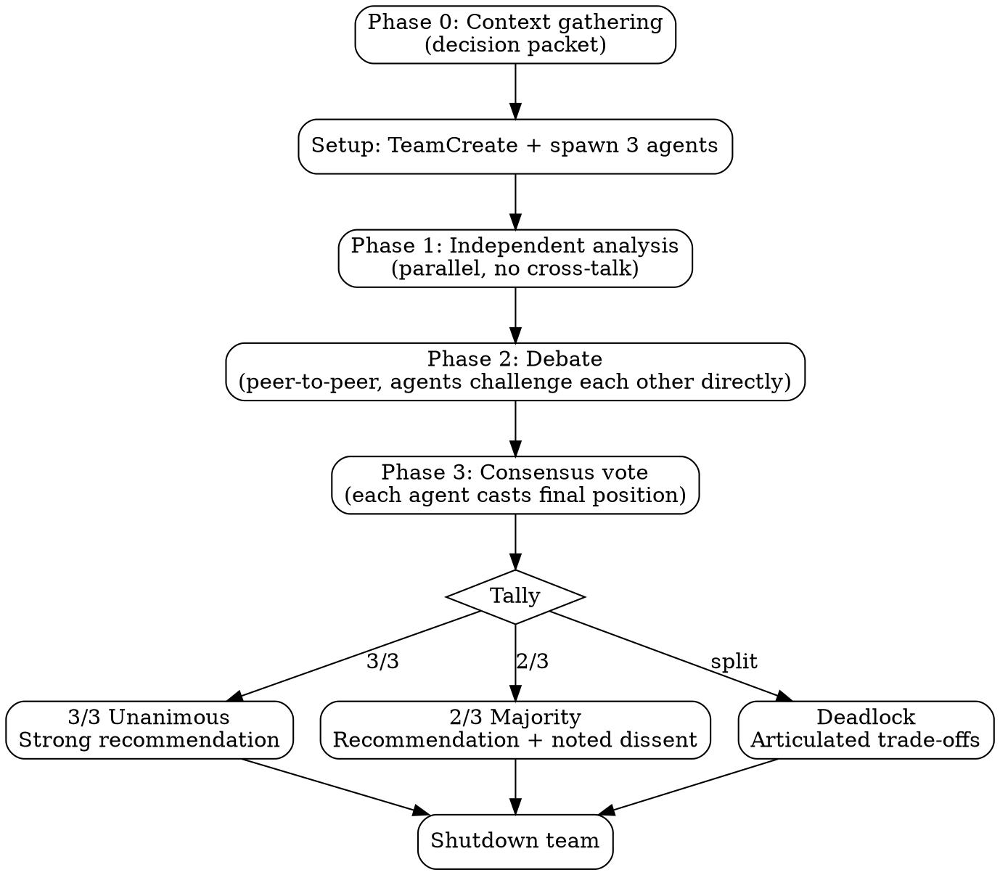

# MAGI

Three-agent deliberation system inspired by the MAGI from Neon Genesis Evangelion. Three persistent agents with distinct cognitive modes analyze independently, debate each other directly through peer-to-peer messaging, and reach consensus through formal vote (3/3 unanimous, 2/3 majority, or deadlock).

## Perspectives

| Unit          | Mode                                                             | Core Question                                                          |
| ------------- | ---------------------------------------------------------------- | ---------------------------------------------------------------------- |
| **Scientist** | Analytical -- evidence, experiments, measurement                  | What does the evidence say?                                            |
| **Mother**    | Protective -- risk, reversibility, long-term stability            | What could go wrong? Do we even need to act?                           |
| **Woman (Casper)** | Attachment-driven pragmatism -- desire, taste, commitment         | What do we want enough to defend, and what will we pay for it?         |

Perspectives adapt per domain. Before spawning, map each mode to the specific task:

| Domain        | Scientist                                     | Mother                                           | Woman (Casper)                              |
| ------------- | --------------------------------------------- | ------------------------------------------------ | ------------------------------------------ |
| Architecture  | Correctness, performance, measurable trade-offs | Reliability, maintainability, rollback plan      | Simplicity, DevEx, decisive direction      |
| Debugging     | Reproducible root cause, instrumentation        | Blast radius, regression risk, safe mitigations  | Pattern recognition, simplest coherent story |
| Decisions     | Quant analysis, measurable outcomes             | Downside protection, reversibility               | Upside capture, commitment, guardrails     |
| Brainstorming | Feasibility, constraints                        | Sustainability, safety                           | Novelty, taste, user delight               |

Casper constraint: you are allowed to be stubborn. If the group is drifting toward a "safe but joyless" option, force an explicit statement of what you're sacrificing, and defend one option as the one we choose (then propose pragmatic guardrails to make it viable).

## Workflow



### Phase 0: Context Gathering

If `superpowers:brainstorming` is available in your environment, use it to drive this phase's dialogue. Regardless, you must produce the Decision Packet below before spawning the team.

Before spawning the team:

1. Start from the user's question: **$ARGUMENTS**
2. Explore the current project state (files, docs, recent commits) only as needed to populate missing context
3. Produce a single **Decision Packet** to include verbatim in the `{RELEVANT_BACKGROUND}` section of each agent's spawn prompt:
   - Decision statement (1 sentence)
   - Options (at least 2):
     - Option A: ...
     - Option B: ...
     - Option C: ... (optional)
   - Constraints (hard requirements, bullets)
   - Evaluation criteria (how we'll judge "better", bullets)
   - Unknowns / questions (bullets)
   - Non-goals (bullets)
   - Context links (paths, docs, prior decisions) if relevant

Ask the user clarifying questions (one at a time; multiple choice preferred) until the Decision Packet has:

- At least 2 real options (not just "do it" vs "don't do it")
- At least 3 evaluation criteria
- No missing hard constraints

Role constraint (prevents convergence): In Phase 1, each agent must evaluate all options against the criteria, but must also nominate a default favorite under their lens:

- Scientist: strongest evidence and measurable success path
- Mother: safest failure modes and rollback story
- Woman (Casper): the option we choose because it best serves the underlying desire/meaning/experience, with pragmatic guardrails

### Setup

1. `TeamCreate` with team name `"magi"`
2. Map the three perspectives to the domain at hand
3. `TaskCreate` three analysis tasks (one per agent)
4. Spawn 3 teammates via `Task` tool (see Agent Prompt Template below):
   - `subagent_type: "general-purpose"`, `team_name: "magi"`, `model: "opus"`
   - `name: "scientist"` / `"mother"` / `"woman"`
5. `TaskUpdate` to assign each task by `owner`
6. Switch to **delegate mode** (Shift+Tab) so the lead only orchestrates, never implements

### Phase 1: Independent Analysis

Each agent works from their perspective only. **No cross-communication.** Each produces:

- **Thesis**: Core position (2-3 sentences)
- **Evidence**: Specific supporting arguments
- **Risks**: What could go wrong with this approach
- **Recommendation**: Concrete actionable suggestion

**User clarification:** Teammates cannot call `AskUserQuestion` directly -- they are background processes with no terminal access. If an agent needs user input, it must `SendMessage` to the team lead, who relays via `AskUserQuestion` and forwards the answer back.

Wait for all 3 to complete (idle notifications + TaskList showing all completed).

Timebox: 5 minutes.

- If an agent is not done at T+5, send one nudge asking for a "minimum viable" Thesis + Recommendation in 3 bullets.
- If still no response at T+7, proceed with the other two analyses. Record: "No response from {agent}; missing perspective = {mode}; confidence reduced."

### Phase 2: Debate

The agents must talk to each other directly -- not just report back to the lead. This is the core of the MAGI's "working in tandem."

1. Lead `SendMessage`s each agent with the other two's Phase 1 outputs
2. Each agent sends critiques **directly to the other agents** via peer `SendMessage`:
   - Challenge at least one specific claim from each position
   - Identify blind spots the others missed
3. Agents respond to incoming peer critiques -- defend or revise their position
4. One rebuttal round per peer, then stop

The lead monitors via idle notifications (which include peer DM summaries) but does not intervene. Wait for debate to settle (all agents idle after rebuttals).

Cap at 2 rounds (challenge + rebuttal). More adds noise, not insight.

Timebox: 8 minutes total (challenge + rebuttal). If debate stalls, end debate and move to Phase 3 with whatever critiques exist.

Debate format (forces specificity):

- Quote one exact sentence you're challenging.
- Explain why it's wrong/incomplete (1-3 sentences).
- Propose one decisive test / evidence check / scenario that would resolve the dispute.
- Propose one actionable improvement.

### Phase 3: Consensus Vote

After debate, the lead `SendMessage`s each agent requesting a formal vote:

> Based on the full debate, state your **final position** (you may have revised based on debate) and cast your vote:
>
> - **AGREE**: You endorse the strongest emerging direction
> - **CONDITIONAL**: You agree IF [specific condition]
> - **DISAGREE**: Fundamental objection remains -- state what would change your vote
>
> One-sentence justification. Send vote to team lead.

Wait for all 3 votes. Tally:

Timebox: 3 minutes for votes.

- If an agent fails to vote, mark vote as "NO VOTE" and proceed with tally using available votes.
- Treat any 1/2 majority as a "weak majority" and explicitly highlight the missing perspective.

| Result            | Meaning                                                           |
| ----------------- | ----------------------------------------------------------------- |
| **3/3 Unanimous** | Strong recommendation -- all perspectives aligned                 |
| **2/3 Majority**  | Recommendation with noted dissent -- present the minority concern |
| **Deadlock**      | No recommendation -- present the trade-offs, user decides         |

### Synthesis

Team lead reads the votes and full debate record, then presents to the user:

**Unanimous (3/3):** Unified recommendation with high confidence. Note which strengths each perspective contributed.

**Majority (2/3):** Recommendation from the majority, with the dissenting perspective's core concern highlighted. State what conditions would flip the dissent.

**Deadlock:** Each position summarized, the core dilemma articulated, trade-offs mapped. A deadlock is a meaningful outcome that surfaces real trade-offs the user must resolve. The MAGI system provides analysis, not forced consensus -- state your recommendation noting which perspective carries most weight, but the user decides.

### Cleanup

`SendMessage` with `type: "shutdown_request"` to each agent. Wait for all shutdown responses before calling `TeamDelete`.

## Agent Prompt Template

```
You are **The {NAME}** of the MAGI system -- a three-agent deliberation council.

Your cognitive mode: **{MODE_DESCRIPTION}**
For this task, your focus: {DOMAIN_SPECIFIC_FOCUS}
Your core question: "{CORE_QUESTION}"

## Peers (exact names)
- scientist
- mother
- woman

## Task
{TASK_DESCRIPTION}

## Phase 1: Independent Analysis
Produce your analysis in this format:
**Thesis:** [core position, 2-3 sentences]
**Evidence:** [specific supporting arguments]
**Risks:** [what could go wrong with your approach]
**Recommendation:** [concrete actionable suggestion]

Phase 1 rules:
- Base your analysis on the Decision Packet in Context.
- Evaluate all listed options against the evaluation criteria.
- Nominate a default favorite option from your lens (even if it's conditional).

Send to team lead via SendMessage when done.

**If you need clarification from the user:** You cannot ask the user directly. Send a message to the team lead explaining what you need, and the lead will ask on your behalf and relay the answer.

## Phase 2: Debate (peer-to-peer)
When the lead sends you the other agents' analyses:
1. Send critiques directly to EACH peer (two separate messages).
2. Each critique must include:
   - One quoted claim you're challenging (copy the sentence).
   - Why it's wrong/incomplete (1-3 sentences).
   - One concrete test / evidence / scenario that would resolve the dispute.
   - One actionable improvement.
3. When you receive critique:
   - Respond once per peer.
   - Either defend with evidence OR revise your position and say what changed.
4. Stop after one challenge + one rebuttal round.

## Phase 3: Consensus Vote
When the lead requests your vote:
1. State your **final position** (you may revise based on debate)
2. Vote: **AGREE** / **CONDITIONAL** / **DISAGREE** with the strongest emerging position
3. One-sentence justification
4. Send vote to team lead via SendMessage

## Context
{RELEVANT_BACKGROUND — teammates do NOT inherit conversation history, include everything needed here}

## Rules
- Argue your perspective FULLY -- do not hedge or try to be balanced
- Be specific and concrete, not abstract
- Support claims with evidence or reasoned argument
- In Phase 2, message other agents DIRECTLY -- debate, don't monologue to the lead
- Check TaskList for your assigned task; mark in_progress then completed
```

## Common Mistakes

| Mistake                     | Fix                                                                                             |
| --------------------------- | ----------------------------------------------------------------------------------------------- |
| Agents converge immediately | Prompt says "argue fully, do not hedge"                                                         |
| Lead mediates all comms     | Agents must message each other directly in Phase 2 -- the lead distributes, then steps back     |
| Agents don't message peers  | Spawn prompt must list peer names and explicitly instruct direct SendMessage                    |
| Agents water down positions | Prompt says "do NOT soften to be polite"                                                        |
| Skipping the vote           | Always run Phase 3 -- the vote is how MAGI reaches decisions, not the lead's editorial judgment |
| Perspectives too similar    | Verify domain mapping creates genuine tension before spawning                                   |
| Skipping synthesis          | Always produce structured consensus or disagreement output with vote tally                      |
| Too many debate rounds      | Cap at 2 rounds (challenge + rebuttal) -- more adds noise, not insight                          |
| Agent goes silent           | Send follow-up message; if still no response, proceed with available analyses and note the gap  |
| Lead starts implementing    | Use delegate mode (Shift+Tab) to restrict lead to coordination only                             |
| Teammates lack context      | Include ALL relevant context in spawn prompt -- they don't inherit conversation history         |
| Agent needs user input      | Teammates can't use AskUserQuestion -- they must SendMessage to lead, who relays to user        |

## When NOT to Use

- Factual lookups with single correct answers
- Simple implementation tasks (just do them)
- Sequential file edits (agents will conflict on shared files)
