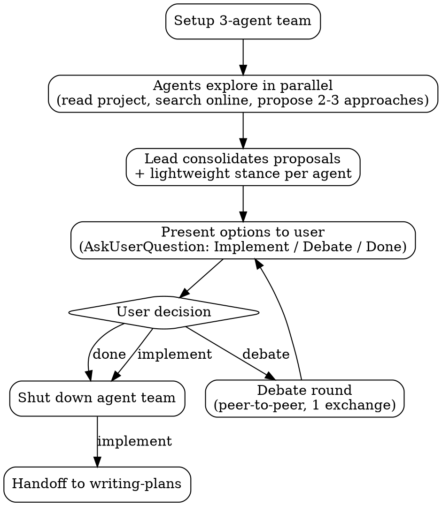

# MAGI

Three-agent deliberation system. Spawns Scientist, Mother, and Woman agents with competing value lenses to explore a question in parallel, then consolidates their proposals for the user.

## Checklist

You MUST create a task for each of these items and complete them in order:

1. Setup agent team
2. Parallel exploration
3. Consolidate and present options
4. Wait for user decision (implement, debate, or done)
5. Tear down agent team

## Workflow

## The Process

### Setup

- Create tasks for each checklist item (with activeForm for spinner display)
- Read all 3 template files: [MAGI-1.md](templates/MAGI-1.md), [MAGI-2.md](templates/MAGI-2.md), [MAGI-3.md](templates/MAGI-3.md)
- `TeamCreate` with a descriptive team name `magi-{topic}` (e.g., `magi-auth-strategy`)
- Spawn all 3 teammates in a **single message** (3 parallel `Task` calls):
  - `subagent_type`: `"general-purpose"`
  - `team_name`: team name from above
  - `name`: `"Scientist"` / `"Mother"` / `"Woman"`
  - `prompt`: template content + user's question + Agent Checklist (below)

Teammates don't inherit the lead's conversation history -- include all context in the spawn prompt.

### Parallel Exploration

Agents begin working immediately upon spawning. The lead's role is **coordination only**:

- Wait for teammates to send their proposals via `SendMessage`
- If an agent sends a clarifying question, consolidate and ask the user via `AskUserQuestion`
- Do NOT explore, research, or generate proposals yourself

#### Agent Checklist

Each agent MUST create a task for each step and complete them in order:

1. **Explore project state** -- check files, docs, recent commits
2. **Search online** -- find relevant prior art, docs, discussions. DO NOT skip this.
3. **Evaluate/generate options** -- if user is open-ended, generate from scratch; if user supplies options, evaluate those AND propose alternatives. Surface non-obvious ideas -- discover what's missing, don't just analyze what's given.
4. **Propose 2-3 approaches** -- with trade-offs from your persona's lens
5. **Tag top pick** -- one-line rationale for your recommended option
6. **Report to lead** -- send your proposals and top pick to the lead via `SendMessage`

Each agent may send clarifying questions to the lead. The lead consolidates and asks the user via `AskUserQuestion`:

- One question at a time
- Prefer multiple choice when possible
- Focus on understanding: purpose, constraints, success criteria

### Consolidate + Present

Lead collects all proposals from the 3 agents, then:

1. Deduplicates similar proposals (attributing to all agents who proposed it)
2. Groups by theme if there are many proposals
3. Presents each option with:
   - Which agent(s) proposed it
   - Trade-off analysis from each perspective
   - Who tagged it as their top pick and why
4. Asks the user via `AskUserQuestion` with 3 options:
   - **Implement** — pick option(s) to implement (triggers teardown + handoff to `writing-plans`)
   - **Debate** — agents critique each other's proposals (triggers debate round below)
   - **Done** — shut down the agent team, no further action

### Optional Debate (user-triggered)

Only runs if the user requests it. When triggered:

1. Create a "Debate" task
2. Send the consolidated option list to all agents
3. Each agent sends direct messages to each other agent critiquing their proposals
4. Each agent gets one response to defend or concede
5. Lead collects updated stances and re-presents

### Teardown

#### When to tear down

- User selects **Implement**
- User selects **Done**

#### When NOT to tear down

- After presenting proposals -- the debate loop requires live agents

#### Shutdown sequence

1. `shutdown_request` to each teammate (Scientist, Mother, Woman)
2. Wait for all shutdown approvals
3. `TeamDelete` (fails if teammates are still active)

### Handoff (implement path only)

After teardown, invoke `writing-plans` skill with the chosen option(s) as context.
