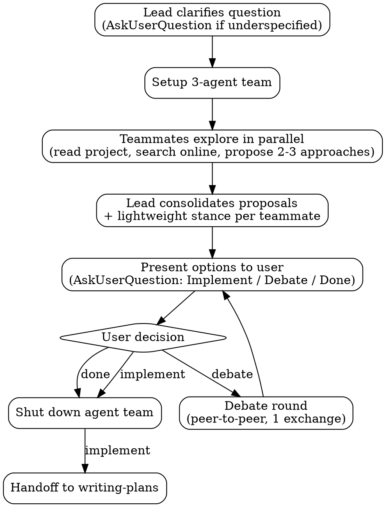

# MAGI

Three-agent brainstorming panel. Spawns Scientist, Mother, and Woman teammates with competing value lenses to explore a question in parallel, then consolidates their proposals for the user.

## Checklist

Follow these steps in order.

1. Clarify the question
2. Set up agent team
3. Parallel exploration
4. Consolidate and present options
5. Wait for user decision (implement, debate, or done)
6. Tear down agent team

## Workflow

## The Process

### User Question

**$ARGUMENTS**

### Clarify

Before spawning teammates, the lead asks via `AskUserQuestion` to understand the idea or topic:

- Ask questions one at a time to refine the idea
- Prefer multiple choice questions when possible, but open-ended is fine too
- Only one question per message - if a topic needs more exploration, break it into multiple questions
- Focus on understanding: purpose, constraints, success criteria

Skip if the question is already clear and actionable. Include all clarified context in teammate spawn prompts.

### Setup

- Read all 3 template files: [MAGI-1.md](templates/MAGI-1.md), [MAGI-2.md](templates/MAGI-2.md), [MAGI-3.md](templates/MAGI-3.md)
- `TeamCreate` with a descriptive team name `magi-{topic}` (e.g., `magi-auth-strategy`)
- Spawn all 3 teammates in a **single message** (3 parallel `Task` calls):
  - `subagent_type`: `general-purpose`
  - `team_name`: team name from above
  - `name`: `scientist` / `mother` / `woman`
  - `prompt`: template content + user's question + clarified context from Clarify step + Teammate Checklist (below)

Teammates don't inherit the lead's conversation history -- include all context in the spawn prompt.

### Explore in Parallel

Teammates begin working immediately upon spawning. The lead's role is **coordination only**:

- Wait for teammates to send their proposals via `SendMessage`
- Forward teammate clarifying questions to the user via `AskUserQuestion` — note which teammate asked. Only the user answers these questions
- Your role is to wait and coordinate — teammates produce all proposals

#### Teammate Checklist

Each teammate MUST create a task for each step and complete them in order:

1. **Explore project state** -- check files, docs, recent commits
2. **Ask clarifying questions** -- if anything is unclear, ask the lead to ask the user. The lead should note which teammate asked
3. **Search online** -- find relevant prior art, docs, discussions
4. **Evaluate/generate options** -- if user is open-ended, generate from scratch; if user supplies options, evaluate those AND propose alternatives. Surface non-obvious ideas -- discover what's missing, don't just analyze what's given.
5. **Propose 2-3 approaches** -- with trade-offs from your persona's lens
6. **Tag top pick** -- one-line rationale for your recommended option
7. **Report to lead** -- send your proposals and top pick to the lead via `SendMessage`

### Consolidate + Present

Lead collects all proposals from the 3 teammates, then:

1. Deduplicates similar proposals (attributing to all teammates who proposed it)
2. Groups by theme if there are many proposals
3. Presents each option with:
   - Which teammate(s) proposed it
   - Trade-off analysis from each perspective
   - Who tagged it as their top pick and why
4. Asks the user via `AskUserQuestion` to **select an option** (one option per choice)
5. Asks the user via `AskUserQuestion` what to do next:
   - **Implement** — triggers teardown + handoff to `writing-plans` with the selected option
   - **Debate** — teammates critique each other's proposals (triggers debate round below)
   - **Done** — shut down the agent team, no further action

### Optional Debate (user-triggered)

Only runs if the user requests it. When triggered:

1. Send the consolidated option list to all teammates
2. Each teammate sends direct messages to each other teammate critiquing their proposals
3. Each teammate gets one response to defend or concede
4. Lead collects updated stances and re-presents

### Teardown

#### When to tear down

- User selects **Implement**
- User selects **Done**

#### Keep teammates alive during the debate loop

Tear down only after the user selects **Implement** or **Done**.

#### Shutdown sequence

1. `shutdown_request` to each teammate (Scientist, Mother, Woman)
2. Wait for all shutdown approvals
3. `TeamDelete` (fails if teammates are still active)

### Handoff (implement path only)

After teardown, invoke `writing-plans` skill with the chosen option(s) as context.
