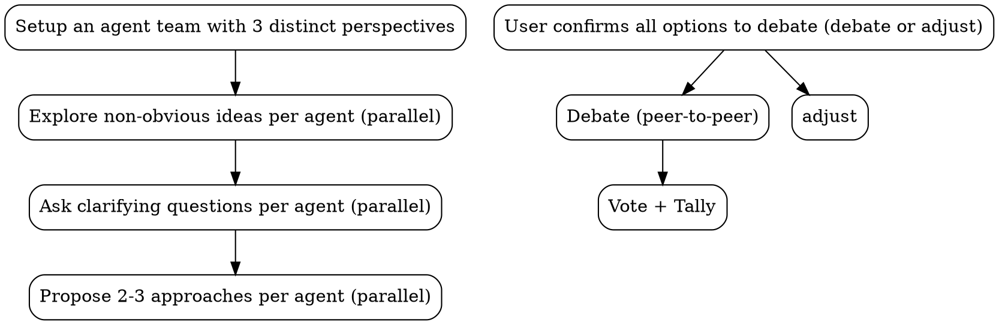

# MAGI

## Workflow

## The Process

### Setup

- Create an agent team with 3 agents:
  - Use [MAGI-1.md](templates/MAGI-1.md) as prompt template when creating `Scientist` agent
  - Use [MAGI-2.md](templates/MAGI-2.md) as prompt template when creating `Mother` agent
  - Use [MAGI-3.md](templates/MAGI-3.md) as prompt template when creating `Woman` agent

### Explore, Ask, Propose (parallel)

3 agents do the following in parallel:

- If the user is open-ended, agents generate options from scratch.
- If the user supplies options (for example, `A vs B`), agents must evaluate those options AND propose alternatives from their own lens.
- In both cases, each agent must surface non-obvious ideas. Don't just analyze what's given -- discover what's missing.

Understanding the idea:

- Check out the current project state first (files, docs, recent commits)
- Search for relevant information

Ask clarifying questions:

- Ask questions one at a time to refine the idea
- Prefer multiple choice questions when possible, but open-ended is fine too
- Only one question per message - if a topic needs more exploration, break it into multiple questions
- Focus on understanding: purpose, constraints, success criteria

Exploring approaches:

- Propose 2-3 different approaches with trade-offs
- Present options conversationally with your recommendation and reasoning
- Lead with your recommended option and explain why

### Confirm

Lead consolidates all options across agents and present them to the user for confirmation before debate.

Each option should be clearly labeled with which agent proposed it, and which one they recommended, and the reasoning behind it.

### Debate

- Agents debate each other through peer-to-peer messaging, directly challenging each other's proposals and reasoning.
- Each agent must respond to critiques of their proposals, defending their position or conceding points.
- The debate runs 1 full exchnage (each agent gets to respond once to each other agent's proposals) before moving to vote.

### Vote

- Each agent votes "Approve" or "Deny" on each proposal, with explanations rooted in their perspective.
- The lead tallies the votes and presents the final decision to the user, along with the reasoning from each agent.
- The user can then choose to implement the winning proposal, or ask for another round of debate with adjusted proposals.
