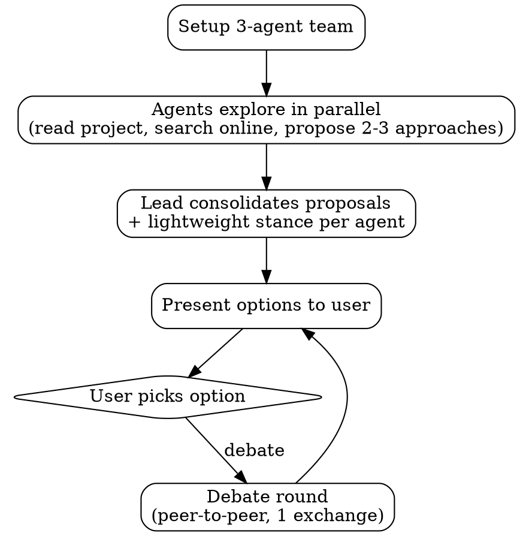

# MAGI

## Checklist

You MUST create a task for each of these items and complete them in order:

1. Setup agent team
2. Parallel exploration
3. Consolidate and present options
4. Present final options

## Workflow

## The Process

### Setup

- Create tasks for each checklist item (with activeForm for spinner display)
- Create an agent team with 3 agents:
  - Use [MAGI-1.md](templates/MAGI-1.md) as prompt template when creating `Scientist` agent
  - Use [MAGI-2.md](templates/MAGI-2.md) as prompt template when creating `Mother` agent
  - Use [MAGI-3.md](templates/MAGI-3.md) as prompt template when creating `Woman` agent

### Parallel Exploration

Send the user's question + relevant project context to all 3 agents simultaneously. Each agent:

- Checks the current project state (files, docs, recent commits)
- **Searches online** for relevant information. DO NOT rely solely on pre-training data.
- If the user is open-ended, generates options from scratch
- If the user supplies options (e.g. `Should I do A?` or `Which is better? A vs B`), evaluates those AND proposes alternatives from their own lens
- In both cases, surfaces non-obvious ideas -- discover what's missing, don't just analyze what's given
- Proposes 2-3 approaches with trade-offs from their persona's lens
- Tags their top pick with a one-line rationale

Each agent may send clarifying questions to the lead. The lead consolidates and asks the user via `AskUserQuestion`:

- One question at a time
- Prefer multiple choice when possible
- Focus on understanding: purpose, constraints, success criteria

### Consolidate + Present

Lead collects all proposals from the 3 agents, then:

1. Deduplicates similar proposals (attributing to all agents who proposed it)
2. Groups by theme if there are many proposals
3. Presents each option with:
   - Which agent(s) proposed it
   - Trade-off analysis from each perspective
   - Who tagged it as their top pick and why
4. Asks the user: pick an option, or say "debate" for deeper analysis

### Optional Debate (user-triggered)

Only runs if the user requests it. When triggered:

1. Create a "Debate" task
2. Send the consolidated option list to all agents
3. Each agent sends direct messages to each other agent critiquing their proposals
4. Each agent gets one response to defend or concede
5. Lead collects updated stances and re-presents

### Optional Handoff

After the user picks an option, ask whether to transition to implementation planning with `writing-plans` skill. If yes, pass the chosen approach as context.
