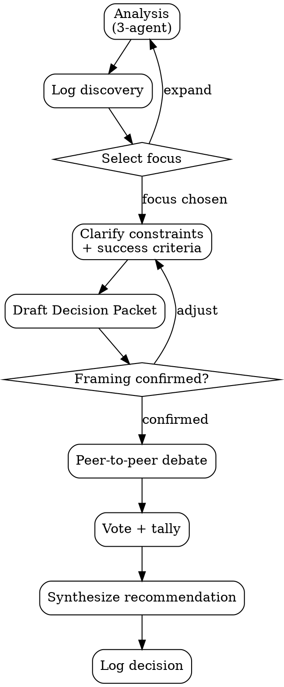

# MAGI

## Overview

MAGI is a three-agent deliberation workflow inspired by the MAGI system from Neon Genesis Evangelion. It is designed for decisions where trade-offs are real and no single concern should dominate.

Every run starts with Analysis -- even when the user supplies predefined options. Analysis includes opportunity generation, option evaluation, and framing before debate.

Pipeline:

1. Analysis (3-agent ideation + option evaluation + framing)
2. Debate (peer-to-peer)
3. Vote (consensus tally + synthesis)

### Execution Invariants

- Launch agents with the user's prompt and basic project context (e.g., CLAUDE.md contents). Do not run a lead-led codebase exploration pass -- agents will self-orient through their own lens.
- Create the MAGI team before backlog drafting so each agent can ideate and analyze independently.
- Lead orchestrates; agents argue. The lead does not substitute its own judgment for agent outputs.
- Discovery and option evaluation happen in the same Analysis task.
- Debate requires direct peer messages between agents (not lead-mediated monologues).
- Every run must include voting, even when consensus seems obvious.
- Every run must write two logs to `docs/magi/`: `YYYY-MM-DD-<topic>-discovery.md` and `YYYY-MM-DD-<topic>-decision.md`.
- Never collapse to a narrow option set before generating a broad opportunity backlog, even when the user supplies predefined options.

## When NOT to Use

- Factual lookups with a single correct answer -- just answer directly or use WebSearch
- Simple implementation tasks where no material trade-off exists -- just implement
- Sequential file edits where parallel agents will conflict on the same files -- use a single agent
- When the user has already decided and just needs execution -- don't deliberate what's settled

## Perspectives

| Unit          | Mode                                                     | Core Question                                                  |
| ------------- | -------------------------------------------------------- | -------------------------------------------------------------- |
| **Scientist** | Analytical - evidence, experiments, measurement          | What does the evidence say?                                    |
| **Mother**    | Protective - risk, reversibility, long-term stability    | What could go wrong? Do we even need to act?                   |
| **Woman**     | Attachment-driven pragmatism - desire, taste, commitment | What do we want enough to defend, and what will we pay for it? |

Domain-specific focus mappings and the Woman stubbornness constraint are defined in `templates/agent-prompt-template.md`.

## Input Handling

- If the user supplies predefined options (e.g., "A vs B"), seed those as context for Analysis agents. Agents must evaluate the supplied options AND propose alternatives from their lens.
- If the user asks an open-ended prompt ("anything to improve," "brainstorm," "surprise me"), agents ideate freely with no seed options.

## Workflow



### Analysis (Hard Gate)

**Entry criteria:** User asks for recommendations, trade-off analysis, or open-ended prioritization.

1. Start from the user question: **$ARGUMENTS**.
2. Start the team and launch Analysis immediately:
   - `TeamCreate` team `magi` with three agents: `scientist`, `mother`, `woman`.
   - `TaskCreate` one Analysis task per agent using `templates/agent-prompt-template.md`.
   - Pass the user's prompt, any user-supplied options, and basic project context. Do not run a lead-led exploration pass -- agents self-orient through their own lens.
   - Each agent independently:
     - proposes **5-7 opportunities** from its lens, including **1 crazy-but-plausible** bet and a 2-item kill list
     - evaluates supplied options (if any) and proposes additional alternatives
     - evaluates options against provided criteria, or proposes provisional criteria if none are provided yet
     - nominates a default favorite under its lens
3. Consolidate agent outputs into an Opportunity Backlog using the required schema below.
   - Generate **12-20 consolidated candidate opportunities** across at least **5 distinct lenses** (for example: product UX, reliability, growth, operations, DevEx, quality, trust/safety, monetization).
   - Preserve source attribution for each consolidated candidate (which agent(s) proposed it).
   - Enforce a novelty quota: at least **30%** of candidates must be non-obvious or contrarian relative to current roadmap direction.
   - Include surprise bets from each perspective: at least **1 Scientist**, **1 Mother**, and **1 Woman** "crazy-but-plausible" bet.
   - For each candidate, include impact hypothesis, effort band, confidence, and primary risk.
4. Write/update discovery log at `docs/magi/YYYY-MM-DD-<topic>-discovery.md` using `templates/discovery-log-template.md`.
5. Ask the user to choose next step using `AskUserQuestion` with exactly:
   - `Proceed with recommended focus`
   - `Choose a different focus from backlog`
   - `Expand ideation before deciding`
   - If user selects expand ideation, run another Analysis iteration with gap-targeted prompts, then repeat from step 3.
6. Ask clarifying questions one at a time via `AskUserQuestion` (prefer multiple-choice):
   - Decision objective
   - Constraints and non-negotiables
   - Success criteria
   - Explicitly out-of-scope items
7. Draft a Decision Packet using the required schema below.
8. Validate the packet:
   - At least 4 options, with at least 1 wildcard/contrarian option
   - Options must span at least 3 distinct themes (not variants of one idea)
   - At least 3 evaluation criteria
   - Non-goals and unknowns included
9. Present packet for confirmation using `AskUserQuestion` with exactly:
   - `Looks good, start deliberation`
   - `I want to adjust framing`
10. If user selects adjust, revise packet and repeat Step 9.
11. Share the confirmed Decision Packet with all three agents as final Analysis context for debate.

**Exit criteria:**

- Backlog has been produced and user-selected focus is explicit.
- User has confirmed framing.
- Team exists with three agents.
- Three Analysis outputs are available (or fallback documented).

#### Opportunity Backlog Schema

```markdown
## Opportunity Surface

- <lenses covered and why they matter for this context>

## Agent Analysis Inputs

- Scientist: <lens thesis, 5-7 opportunities, crazy bet, kill list, default favorite>
- Mother: <lens thesis, 5-7 opportunities, crazy bet, kill list, default favorite>
- Woman: <lens thesis, 5-7 opportunities, crazy bet, kill list, default favorite>

## Candidate Opportunities (12-20 consolidated)

- O1 [S|M|W]: <title> -- Impact: <hypothesis>; Effort: <S/M/L>; Confidence: <low/med/high>; Risk: <main downside>
- O2: ...

## Surprise Bets (minimum 3; one per perspective)

- S1 [Scientist]: <crazy-but-plausible idea + why it might win>
- S2 [Mother]: <crazy-but-plausible idea + safety/reversibility guardrails>
- S3 [Woman]: <crazy-but-plausible idea + user/desire upside>

## Novelty Mix

- Conventional candidates: <count>
- Non-obvious/contrarian candidates: <count and %>

## Coverage Gaps

- <areas not yet explored that could hide important opportunities>

## Recommended Focus Set (Top 3)

- R1: <candidate ID + why now>
- R2: ...
- R3: ...
```

#### Decision Packet Schema (Required Order)

```markdown
## Decision Statement

<1 sentence, concrete and falsifiable>

## Options

- Option A: <real alternative>
- Option B: <real alternative>
- Option C: <real alternative>
- Option D: <wildcard/contrarian alternative>

## Constraints

- <hard requirements, legal/technical/time/budget>

## Evaluation Criteria

- <criterion 1>
- <criterion 2>
- <criterion 3>

## Unknowns

- <uncertainties that could change the recommendation>

## Non-Goals

- <what this decision will NOT solve>

## Option Source Notes

- <map each option to Opportunity Backlog IDs and note what was intentionally excluded>

## Context Links

- <repo paths, docs, prior decisions, metrics, incidents>
```

### Debate (Peer-to-Peer)

**Entry criteria:** Analysis outputs collected, Decision Packet confirmed, or fallback acknowledged.

1. Lead sends each agent:
   - the other agents' Analysis outputs
   - the confirmed Decision Packet
2. Agents debate directly with each peer using `SendMessage` (critique format defined in `templates/agent-prompt-template.md`).
3. Debate cap: 2 full rounds per pair (challenge -> rebuttal -> challenge -> rebuttal), then stop.
4. Early stop: all agents explicitly state no further objections.

Lead behavior: monitor only; do not mediate content. If stalled, apply the unresponsive agent rule.

**Exit criteria:** Debate rounds complete or early stop condition reached, with transcript captured.

### Vote

**Entry criteria:** Debate complete or explicitly terminated.

Lead asks each agent to submit final vote (format defined in `templates/agent-prompt-template.md`).

Lead tallies votes:

| Result            | Meaning                                                           |
| ----------------- | ----------------------------------------------------------------- |
| **3/3 Unanimous** | Strong recommendation with aligned perspectives                   |
| **2/3 Majority**  | Recommendation with explicit dissent and conditions to resolve it |
| **Deadlock**      | No consensus; articulate trade-offs and hand decision to user     |

**Exit criteria:** Three votes received (or missing vote documented) and tally determined.

### Synthesis Output Contract

Present final synthesis to user using this structure:

```markdown
## Decision

<unanimous recommendation, majority recommendation, or deadlock>

## Why This Wins (by Criteria)

- <criterion-level comparison>

## Risks and Guardrails

- <key downside>
- <guardrail>

## First Actionable Next Step

- <specific first step>

## Dissent and Flip Conditions

- <minority concern and what evidence would change outcome>
```

Synthesis rules:

- Unanimous: emphasize how each perspective strengthened confidence.
- Majority: include minority concern verbatim in substance.
- Deadlock: present options, trade-offs, and your best recommendation while making clear the user decides.

### Logging Artifacts

Write two artifacts per run:

- Discovery log: `docs/magi/YYYY-MM-DD-<topic>-discovery.md`
- Decision log: `docs/magi/YYYY-MM-DD-<topic>-decision.md`

Requirements:

1. Ensure directory exists first: `mkdir -p docs/magi`.
2. Discovery log must include the full opportunity surface (all raw agent proposals and full consolidated backlog), not only shortlisted items.
3. Decision log must include Analysis summaries and full debate transcript, not a summary.
4. If fallback occurred (silent agent, missing data), include confidence note in decision log.

## Templates (read on demand, not at skill load)

- **Agent Prompt Template:** `templates/agent-prompt-template.md` -- read when spawning agents. Includes domain focus mappings, Woman constraint, and Analysis/Debate/Vote output formats.
- **Discovery Log Template:** `templates/discovery-log-template.md` -- read when writing discovery artifacts.
- **Decision Log Template:** `templates/decision-log-template.md` -- read when writing decision artifacts.

## Common Mistakes (Symptom -> Corrective Action)

| Symptom                                                     | Corrective Action                                                                                                                                 |
| ----------------------------------------------------------- | ------------------------------------------------------------------------------------------------------------------------------------------------- |
| Discovery kickoff is delayed by lead pre-explore            | Start Analysis immediately (`TeamCreate` + 3 `TaskCreate`); agents self-orient through their own lens                                              |
| Separate discovery and analysis tasks are created           | Use one Analysis task per agent; do not split opportunity generation from option evaluation                                                         |
| Open-ended prompt ran without 3-agent opportunity generation | Run Analysis first: each agent must produce 5-7 opportunities, then consolidate                                                                     |
| User-supplied options treated as final without expansion     | Seed user options as input to Analysis agents; always produce full Opportunity Backlog before locking options                                       |
| Option set is shallow (`do` vs `do not`)                    | Rewrite options to at least two real implementation alternatives                                                                                  |
| Option set is broad in count but narrow in type             | Enforce theme diversity and include at least one wildcard option                                                                                  |
| Backlog is high-volume but still bland                      | Enforce novelty quota and require one crazy-but-plausible bet per perspective                                                                     |
| Discovery log omits discovered opportunities                | Log full raw agent inputs and full consolidated backlog; never only top-3                                                                         |
| Lead mediates debate content                                | Re-route agents to direct peer `SendMessage` and step back                                                                                        |
| Agents converge too quickly without challenge               | Reinforce "argue fully" and require quoted-claim critiques                                                                                        |
| Debate runs indefinitely                                    | Enforce 2-round cap and move to vote                                                                                                              |
| Vote skipped because result seems obvious                   | Run Vote regardless; tally only from explicit votes                                                                                               |
| Vote lacks flip conditions                                  | Request corrected vote format from missing agents                                                                                                 |
| Agent goes silent                                           | Nudge once; if still silent, proceed with available outputs and note reduced confidence. In voting, mark as "NO VOTE"; treat 1/2 as weak majority |
| Synthesis ignores dissent                                   | Add dissent section with explicit flip conditions                                                                                                 |
| Decision log is missing transcript/details                  | Rewrite decision log using template and include full debate messages                                                                              |
