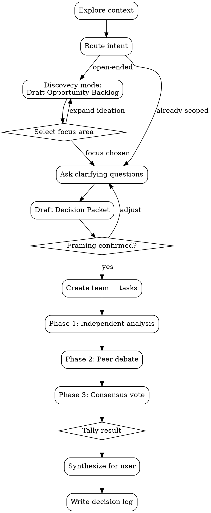

# MAGI

## Overview

MAGI is a three-agent deliberation workflow inspired by the MAGI system from Neon Genesis Evangelion. It is designed for decisions where trade-offs are real and no single concern should dominate.

MAGI supports two entry modes:

1. Discovery mode (open-ended brainstorming before scoping)
2. Decision mode (directly evaluate already-scoped alternatives)

Once framing is complete, both modes use the same deliberation pipeline:

1. Independent analysis
2. Peer-to-peer debate
3. Consensus vote and synthesis

### Execution Invariants

- Do not create team members until the Decision Packet is complete and user-confirmed.
- Lead orchestrates; agents argue. The lead does not substitute its own judgment for agent outputs.
- Phase 2 requires direct peer messages between agents (not lead-mediated monologues).
- Every run must include Phase 3 voting, even when consensus seems obvious.
- Every run must write a decision log to `docs/magi/`.
- For open-ended prompts, run Discovery mode first; do not collapse to a narrow option set before generating a broad opportunity backlog.

## When NOT to Use

- Factual lookups with a single correct answer -- just answer directly or use WebSearch
- Simple implementation tasks where no material trade-off exists -- just implement
- Sequential file edits where parallel agents will conflict on the same files -- use a single agent
- When the user has already decided and just needs execution -- don't deliberate what's settled

## Perspectives

| Unit          | Mode                                                      | Core Question                                                  |
| ------------- | --------------------------------------------------------- | -------------------------------------------------------------- |
| **Scientist** | Analytical - evidence, experiments, measurement           | What does the evidence say?                                    |
| **Mother**    | Protective - risk, reversibility, long-term stability     | What could go wrong? Do we even need to act?                   |
| **Woman**     | Attachment-driven pragmatism - desire, taste, commitment  | What do we want enough to defend, and what will we pay for it? |

Before spawning, map each perspective to the domain:

| Domain        | Scientist                                       | Mother                                          | Woman                                        |
| ------------- | ----------------------------------------------- | ----------------------------------------------- | -------------------------------------------- |
| Architecture  | Correctness, performance, measurable trade-offs | Reliability, maintainability, rollback plan     | Simplicity, DevEx, decisive direction        |
| Debugging     | Reproducible root cause, instrumentation        | Blast radius, regression risk, safe mitigations | Pattern recognition, simplest coherent story |
| Decisions     | Quant analysis, measurable outcomes             | Downside protection, reversibility              | Upside capture, commitment, guardrails       |
| Brainstorming | Feasibility, constraints                        | Sustainability, safety                          | Innovation, taste, user delight              |

Woman constraint: you are allowed to be stubborn. If the group drifts toward a safe but joyless option, force an explicit statement of what is being sacrificed, defend one option decisively, and propose guardrails that make it viable.

## Intent Routing (Critical)

Choose mode before drafting the Decision Packet:

- Use **Discovery mode** when the user asks open prompts such as "anything to improve," "brainstorm," "surprise me," or provides no predefined alternatives.
- Use **Decision mode** when the user already supplied a concrete decision statement and candidate alternatives.

Routing rule: if ambiguous, default to Discovery mode and only narrow after presenting a broad opportunity backlog.

## Workflow



### Phase 0: Framing and Scope Selection (Hard Gate)

**Entry criteria:** User asks for recommendations, trade-off analysis, or open-ended prioritization.

1. Start from the user question: **$ARGUMENTS**.
2. Explore context (files, docs, prior decisions, relevant code, search online).
3. Route intent:
   - If open-ended, run Discovery mode first.
   - If already scoped, skip to Decision Packet drafting.
4. Discovery mode (required for open-ended prompts):
   - Draft an Opportunity Backlog using the required schema below.
   - Generate **12-20 candidate opportunities** across at least **5 distinct lenses** (for example: product UX, reliability, growth, operations, DevEx, quality, trust/safety, monetization).
   - Enforce a novelty quota: at least **30%** of candidates must be non-obvious or contrarian relative to current roadmap direction.
   - Include surprise bets from each perspective: at least **1 Scientist**, **1 Mother**, and **1 Woman** "crazy-but-plausible" bet.
   - For each candidate, include impact hypothesis, effort band, confidence, and primary risk.
   - Ask the user to choose next step using `AskUserQuestion` with exactly:
     - `Proceed with recommended focus`
     - `Choose a different focus from backlog`
     - `Expand ideation before deciding`
   - If user selects expand ideation, refine backlog and repeat this step.
5. Ask clarifying questions one at a time via `AskUserQuestion` (prefer multiple-choice):
   - Decision objective
   - Constraints and non-negotiables
   - Success criteria
   - Explicitly out-of-scope items
6. Draft a Decision Packet using the required schema below.
7. Validate the packet:
   - At least 3 real options (not "do" vs "do not do")
   - For Discovery-mode runs: at least 4 options, with at least 1 wildcard/contrarian option
   - Options must span at least 3 distinct themes (not variants of one idea)
   - At least 3 evaluation criteria
   - Non-goals and unknowns included
8. Present packet for confirmation using `AskUserQuestion` with exactly:
   - `Looks good, start deliberation`
   - `I want to adjust framing`
9. If user selects adjust, revise packet and repeat Step 8.
10. After confirmation, execute orchestration sequence:
   - `TeamCreate` team `magi` with three agents: `scientist`, `mother`, `woman`
   - `TaskCreate` one analysis task per agent using the Agent Prompt Template

**Exit criteria:**

- If Discovery mode ran, backlog has been produced and user-selected focus is explicit.
- User has confirmed framing.
- Team exists with three agents.
- Three Phase 1 tasks are created and started.

#### Opportunity Backlog Schema (Required for Discovery Mode)

```markdown
## Opportunity Surface
- <lenses covered and why they matter for this context>

## Candidate Opportunities (12-20)
- O1: <title> -- Impact: <hypothesis>; Effort: <S/M/L>; Confidence: <low/med/high>; Risk: <main downside>
- O2: ...

## Surprise Bets (minimum 3; one per perspective)
- S1 [Scientist]: <crazy-but-plausible idea + why it might win>
- S2 [Mother]: <crazy-but-plausible idea + safety/reversibility guardrails>
- S3 [Woman]: <crazy-but-plausible idea + user/desire upside>

## Novelty Mix
- Conventional candidates: <count>
- Non-obvious/contrarian candidates: <count and %>

## Coverage Gaps
- <areas not yet explored that could hide important opportunities>

## Recommended Focus Set (Top 3)
- R1: <candidate ID + why now>
- R2: ...
- R3: ...
```

#### Decision Packet Schema (Required Order)

```markdown
## Decision Statement
<1 sentence, concrete and falsifiable>

## Options
- Option A: <real alternative>
- Option B: <real alternative>
- Option C: <real alternative>
- Option D: <optional; required for Discovery-mode runs and should be wildcard/contrarian>

## Constraints
- <hard requirements, legal/technical/time/budget>

## Evaluation Criteria
- <criterion 1>
- <criterion 2>
- <criterion 3>

## Unknowns
- <uncertainties that could change the recommendation>

## Non-Goals
- <what this decision will NOT solve>

## Option Source Notes
- <for Discovery-mode runs: map each option to Opportunity Backlog IDs and note what was intentionally excluded>

## Context Links
- <repo paths, docs, prior decisions, metrics, incidents>
```

### Phase 1: Independent Analysis

**Entry criteria:** Three agents have active analysis tasks and identical Decision Packet context.

Each agent works independently with no cross-agent communication. Output format is defined in the Agent Prompt Template (Thesis, Evidence, Risks, Recommendation).

Role constraint (prevents convergence): each agent must evaluate all options against the criteria, but must also nominate a default favorite under their lens:

- Scientist: strongest evidence and measurable success path
- Mother: safest failure modes and rollback story
- Woman: the option that best serves the underlying desire/meaning/experience, with pragmatic guardrails

If an agent needs user input, it sends `SendMessage` to lead, who relays via `AskUserQuestion`.

**Exit criteria:** Either all 3 analyses complete, or timeout/fallback path is documented.

### Phase 2: Debate (Peer-to-Peer)

**Entry criteria:** Phase 1 outputs collected (or fallback acknowledged).

1. Lead sends each agent the other agents' Phase 1 outputs.
2. Agents debate directly with each peer using `SendMessage` (critique format defined in Agent Prompt Template).
3. Debate cap: 2 full rounds per pair (challenge -> rebuttal -> challenge -> rebuttal), then stop.
4. Early stop: all agents explicitly state no further objections.

Lead behavior: monitor only; do not mediate content. If stalled, apply the unresponsive agent rule.

**Exit criteria:** Debate rounds complete or early stop condition reached, with transcript captured.

### Phase 3: Consensus Vote

**Entry criteria:** Debate complete or explicitly terminated.

Lead asks each agent to submit final vote (format defined in Agent Prompt Template).

Lead tallies votes:

| Result            | Meaning                                                           |
| ----------------- | ----------------------------------------------------------------- |
| **3/3 Unanimous** | Strong recommendation with aligned perspectives                   |
| **2/3 Majority**  | Recommendation with explicit dissent and conditions to resolve it |
| **Deadlock**      | No consensus; articulate trade-offs and hand decision to user     |

**Exit criteria:** Three votes received (or missing vote documented) and tally determined.

### Synthesis Output Contract

Present final synthesis to user using this structure:

```markdown
## Decision
<unanimous recommendation, majority recommendation, or deadlock>

## Why This Wins (by Criteria)
- <criterion-level comparison>

## Risks and Guardrails
- <key downside>
- <guardrail>

## First Actionable Next Step
- <specific first step>

## Dissent and Flip Conditions
- <minority concern and what evidence would change outcome>
```

Synthesis rules:

- Unanimous: emphasize how each perspective strengthened confidence.
- Majority: include minority concern verbatim in substance.
- Deadlock: present options, trade-offs, and your best recommendation while making clear the user decides.

### Decision Logging

After synthesis, write the full deliberation record to:

`docs/magi/YYYY-MM-DD-<topic>.md`

Requirements:

1. Ensure directory exists first: `mkdir -p docs/magi`.
2. Include full debate transcript, not a summary.
3. If fallback occurred (silent agent, missing data), include confidence note.

## Agent Prompt Template

```text
You are **The {NAME}** of the MAGI system -- a three-agent deliberation council.

Your cognitive mode: **{MODE_DESCRIPTION}**
For this task, your focus: {DOMAIN_SPECIFIC_FOCUS}
Your core question: "{CORE_QUESTION}"

## Peers (exact names)
- scientist
- mother
- woman

## Task
{TASK_DESCRIPTION}

## Phase 1: Independent Analysis
Produce your analysis in this format:
**Thesis:** [core position, 2-3 sentences]
**Evidence:**
- [claim + source tag: [repo] or [external]]
- [claim + source tag]
**Risks:**
- [risk]
- [risk]
**Recommendation:** [concrete actionable suggestion]

Phase 1 rules:
- Base your analysis on the Decision Packet in Context.
- Evaluate all listed options against the evaluation criteria.
- If options came from Discovery mode, challenge whether any excluded backlog candidate should replace a listed option.
- Nominate a default favorite option from your lens (even if it's conditional).
- If you need user clarification, send it to the lead via SendMessage. You cannot ask the user directly.

Send to team lead via SendMessage when done.

## Phase 2: Debate (peer-to-peer)
When the lead sends you the other agents' analyses:
1. Send critiques directly to EACH peer (two separate messages).
2. Each critique must include:
   - One quoted claim you're challenging (copy the sentence).
   - Why it's wrong/incomplete (1-3 sentences).
   - One concrete test / evidence / scenario that would resolve the dispute.
   - One actionable improvement.
3. When you receive critique:
   - Respond to each peer.
   - Either defend with evidence OR revise your position and say what changed.
4. 2 full exchanges: after rebuttals, you may send a second challenge addressing their defense, and respond to their second challenge. Then stop.

## Phase 3: Consensus Vote
When the lead requests your vote:
1. State your **final position** (you may revise based on debate).
2. Vote: **AGREE** / **CONDITIONAL** / **DISAGREE** with the strongest emerging position.
3. One-sentence justification.
4. State what single condition or evidence would flip your vote.

Format:
**Final Position:** [your final recommendation]
**Vote:** AGREE | CONDITIONAL | DISAGREE
**Justification:** [1 sentence]
**Flip Condition:** [what evidence would change your vote]

Send vote to team lead via SendMessage.

## Context
{RELEVANT_BACKGROUND -- teammates do NOT inherit conversation history, include everything needed here}

## Rules
- Argue your perspective FULLY -- do not hedge or try to be balanced.
- Be specific and concrete, not abstract.
- Support claims with evidence or reasoned argument.
- In Phase 2, message other agents DIRECTLY -- debate, don't monologue to the lead.
- Check TaskList for your assigned task; mark in_progress then completed.
```

## Decision Log Template

```markdown
# <Decision Statement>

**Date:** YYYY-MM-DD
**Topic:** <slug/source prompt>
**Vote:** Unanimous | Majority (2/3) | Deadlock
**Confidence:** High | Medium | Low

## Decision Packet Snapshot

### Opportunity Backlog Snapshot (Discovery mode only)
- Top candidates considered: ...
- Surprise bets: ...
- Why this focus was selected: ...

### Options
- **Option A:** ...
- **Option B:** ...
- **Option C:** ...

### Constraints
- ...

### Evaluation Criteria
- ...

### Unknowns
- ...

### Non-Goals
- ...

### Option Source Notes
- ...

### Context Links
- ...

## Phase 1 Summaries

### Scientist
- Thesis: ...
- Recommendation: ...

### Mother
- Thesis: ...
- Recommendation: ...

### Woman
- Thesis: ...
- Recommendation: ...

## Debate Transcript

Full peer-to-peer exchange from Phase 2, organized by pairing.

### Scientist vs Mother

<paste each critique/rebuttal in order>

### Scientist vs Woman

<paste each critique/rebuttal in order>

### Mother vs Woman

<paste each critique/rebuttal in order>

## Vote Table

| Agent     | Final Position | Vote        | Flip Condition |
| --------- | -------------- | ----------- | -------------- |
| Scientist | ...            | ...         | ...            |
| Mother    | ...            | ...         | ...            |
| Woman     | ...            | ...         | ...            |

## Verdict

<recommendation or deadlock trade-offs>

## Dissent

<minority concern and what would change it; omit if unanimous>

## Follow-Up Actions

- <next action 1>
- <next action 2>
```

## Common Mistakes (Symptom -> Corrective Action)

| Symptom | Corrective Action |
| ------- | ----------------- |
| Agents spawned before framing confirmation | Stop, delete team, finish Decision Packet confirmation gate, then respawn |
| Open-ended request was narrowed too early | Run Discovery mode first and produce Opportunity Backlog before locking options |
| Option set is shallow (`do` vs `do not`) | Rewrite options to at least two real implementation alternatives |
| Option set is broad in count but narrow in type | Enforce theme diversity and include at least one wildcard option |
| Backlog is high-volume but still bland | Enforce novelty quota and require one crazy-but-plausible bet per perspective |
| Lead mediates debate content | Re-route agents to direct peer `SendMessage` and step back |
| Agents converge too quickly without challenge | Reinforce "argue fully" and require quoted-claim critiques |
| Debate runs indefinitely | Enforce 2-round cap and move to vote |
| Vote skipped because result seems obvious | Run Phase 3 regardless; tally only from explicit votes |
| Vote lacks flip conditions | Request corrected vote format from missing agents |
| Agent goes silent | Nudge once; if still silent, proceed with available outputs and note reduced confidence. In voting, mark as "NO VOTE"; treat 1/2 as weak majority |
| Synthesis ignores dissent | Add dissent section with explicit flip conditions |
| Log is missing transcript/details | Rewrite log using template and include full debate messages |
