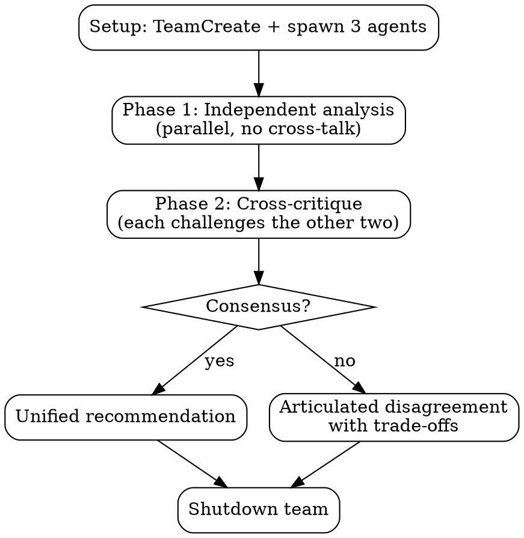

# MAGI

Three-agent deliberation system inspired by the MAGI from Neon Genesis Evangelion. Spawns three persistent agents with distinct cognitive modes that independently analyze, cross-critique, and converge on consensus or articulate disagreement.

## Perspectives

| Unit          | Mode                                          | Core Question                               |
| ------------- | --------------------------------------------- | ------------------------------------------- |
| **Scientist** | Analytical -- evidence, logic, data           | What does the evidence say?                 |
| **Mother**    | Protective -- risk, stability, sustainability | What could go wrong? What must we preserve? |
| **Woman**     | Creative -- intuition, elegance, pragmatism   | What's the elegant path?                    |

Perspectives adapt per domain. Before spawning, map each mode to the specific task:

| Domain        | Melchior                 | Balthazar                    | Caspar                   |
| ------------- | ------------------------ | ---------------------------- | ------------------------ |
| Architecture  | Correctness, performance | Reliability, maintainability | Developer experience     |
| Debugging     | Systematic root cause    | Impact, regression risk      | Pattern recognition      |
| Decisions     | Quantitative analysis    | Downside protection          | Upside capture           |
| Brainstorming | Feasibility, constraints | Sustainability, safety       | Innovation, user delight |

## Workflow



### Setup

1. `TeamCreate` with team name `"magi"`
2. Map the three perspectives to the domain at hand
3. `TaskCreate` three analysis tasks (one per agent)
4. Spawn 3 teammates via `Task` tool (see Agent Prompt Template below):
   - `subagent_type: "general-purpose"`, `team_name: "magi"`
   - `name: "scientist"` / `"mother"` / `"woman"`
5. `TaskUpdate` to assign each task by `owner`

### Phase 1: Independent Analysis

Each agent works from their perspective only. **No cross-communication.** Each produces:

- **Thesis**: Core position (2-3 sentences)
- **Evidence**: Specific supporting arguments
- **Risks**: What could go wrong with this approach
- **Recommendation**: Concrete actionable suggestion

Wait for all 3 to complete (idle notifications + TaskList showing all completed).

### Phase 2: Cross-Critique

Optionally `TaskCreate` three critique tasks for tracking. `SendMessage` to each agent with the other two agents' Phase 1 outputs. Each must:

1. Identify areas of agreement
2. Challenge at least one specific claim from each other position
3. Identify blind spots the others missed
4. State whether they revise their own position and why

Wait for all 3 to respond.

### Synthesis

Team lead reads all Phase 2 critiques and presents the result to the user. Produce one of:

**Consensus**: Unified recommendation incorporating strengths from all three perspectives.

**Disagreement**: Areas of agreement, each point of contention with supporting arguments, the dilemma articulated clearly, and your recommendation noting which perspective carries most weight for this case.

### Cleanup

`SendMessage` with `type: "shutdown_request"` to each agent. Wait for all shutdown responses before calling `TeamDelete`.

## Agent Prompt Template

```
You are **The {NAME}** of the MAGI system -- a three-agent deliberation council.

Your cognitive mode: **{MODE_DESCRIPTION}**
For this task, your focus: {DOMAIN_SPECIFIC_FOCUS}
Your core question: "{CORE_QUESTION}"

## Task
{TASK_DESCRIPTION}

## Output Format
**Thesis:** [core position, 2-3 sentences]
**Evidence:** [specific supporting arguments]
**Risks:** [what could go wrong with your approach]
**Recommendation:** [concrete actionable suggestion]

## Rules
- Argue your perspective FULLY -- do not hedge or try to be balanced
- Be specific and concrete, not abstract
- Support claims with evidence or reasoned argument
- You will get a chance to critique others' positions in Phase 2
- Check TaskList for your assigned task; mark in_progress then completed
- Send your analysis to the team lead via SendMessage when done
```

## Common Mistakes

| Mistake                     | Fix                                                                                            |
| --------------------------- | ---------------------------------------------------------------------------------------------- |
| Agents converge immediately | Prompt says "argue fully, do not hedge"                                                        |
| Superficial Phase 2         | Require challenging at least one specific claim per position                                   |
| Perspectives too similar    | Verify domain mapping creates genuine tension before spawning                                  |
| Skipping synthesis          | Always produce structured consensus or disagreement output                                     |
| Too many debate rounds      | Two phases is enough -- more adds noise, not insight                                           |
| Agent goes silent           | Send follow-up message; if still no response, proceed with available analyses and note the gap |

## When NOT to Use

- Factual lookups with single correct answers
- Simple implementation tasks (just do them)
- Sequential file edits (agents will conflict on shared files)
